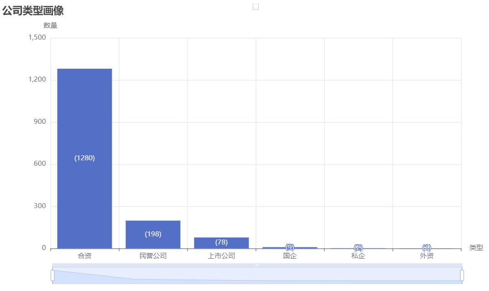
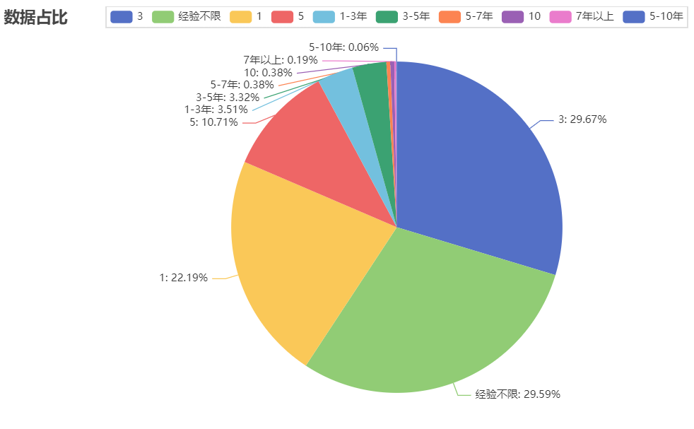
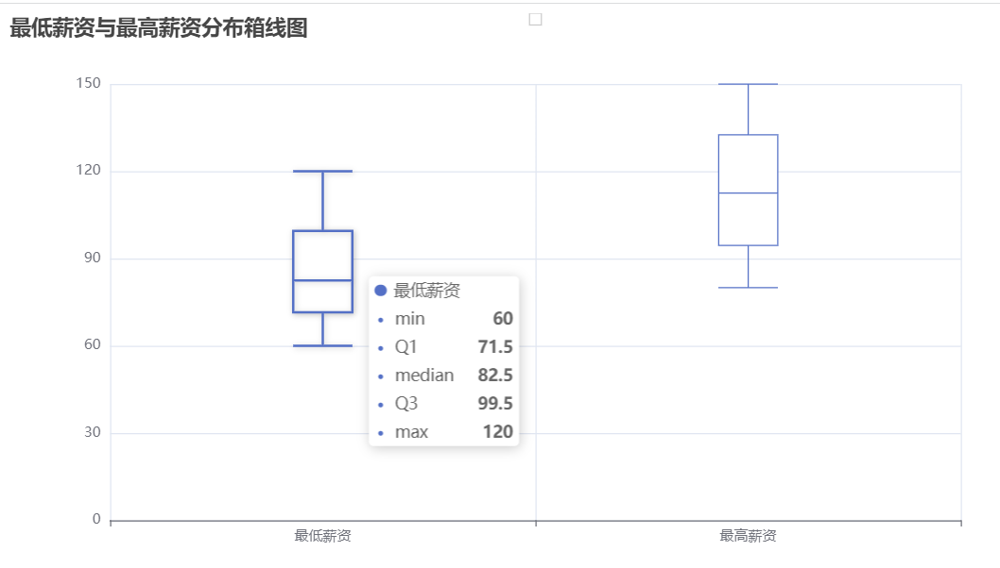

## 柱状图(缩放轴)

效果：



代码：

```python
# 创建图表实例并添加数据
bar = (Bar()
       .add_xaxis([i[0] for i in type_dict])
       .add_yaxis("", [i[1] for i in type_dict])
       .set_series_opts(label_opts=opts.LabelOpts(formatter="({c})"))
       .set_global_opts(title_opts=opts.TitleOpts(title="公司类型画像"),
                        xaxis_opts=opts.AxisOpts(name="类型"),
                        yaxis_opts=opts.AxisOpts(name="数量", axislabel_opts=opts.LabelOpts(formatter="{value}")),
                        datazoom_opts=[
                                        opts.DataZoomOpts(),
                                        opts.DataZoomOpts(type_="inside"),
                                    ],
                        )
       )

# 渲染图表到 HTML 文件
bar.render("招聘信息-公司类型柱状图.html")
```


## 饼形图

效果：



代码：

输出数量及占比

> ```python
> .set_series_opts(label_opts=opts.LabelOpts(formatter="{b}: {c} ({d}%)"))
> ```

```python
from pyecharts.charts import Pie
from pyecharts import options as opts

# 原始数据
raw_data = [('3', 465), ('经验不限', 464), ('1', 348), ('5', 168), ('1-3年', 55), ('3-5年', 52), ('5-7年', 6), ('10', 6), ('7年以上', 3), ('5-10年', 1)]

# 计算每个元素出现的频率
total = sum([count for _, count in raw_data])
data = [(name, round(count/total*100,2)) for name, count in raw_data]

# 创建图表实例并添加数据
pie = (Pie()
       .add("", data)
       .set_series_opts(label_opts=opts.LabelOpts(formatter="{b}:\t{d}%"))
       .set_global_opts(title_opts=opts.TitleOpts(title="数据占比"))
       )

# 渲染图表到 HTML 文件
pie.render("pie_chart.html")
```

话术：


## 箱线图

效果：



代码：

```python
from pyecharts.charts import Boxplot

# 最低薪资和最高薪资数据
data = [
    [60, 70, 72, 75, 80, 85, 90, 96, 110, 120],
    [80, 90, 96, 100, 110, 115, 120, 130, 140, 150]
]

# 创建一个 Boxplot 实例
boxplot = Boxplot()

# 添加数据
boxplot.add_xaxis(["最低薪资", "最高薪资"])
boxplot.add_yaxis("", boxplot.prepare_data(data))

# 设置图表标题
boxplot.set_global_opts(title_opts={"text": "最低薪资与最高薪资分布箱线图"})

# 渲染图表到 HTML 文件
boxplot.render("boxplot.html")
```

话术：

从最低薪资和最高薪资的箱线图可以得出以下结论：

1. 中位数：箱线图中的中线表示中位数，即数据的中间值。如果中位数在两个图的位置相差较大，则说明两个数据集的中位数存在显著差异。
2. 四分位数：箱线的上边缘和下边缘表示第75个和第25个百分位数，也即第三和第一四分位数。通过比较两个数据集的四分位数，可以了解它们的差异和分布情况。
3. 离群点：箱线图的"whiskers"表示数据集的范围。箱线图中超过1.5倍四分位距的值通常被认为是异常值或离群值。不同数据集之间的离群点个数可以反映出两个数据集的差异和离散程度。
4. 对称性：如果两个数据集的箱线图对称，并且没有离群值，那么可以推断出这两个数据集具有相似的形状和离散程度。否则，这两个数据集的相似程度就需要进一步分析。

综上所述，从最低薪资和最高薪资的箱线图中，我们可以了解两个数据集的中位数、四分位数、离群点个数以及分布情况，从而初步判断两个数据集之间的差异和相似程度。但需要注意的是，箱线图只是一种初步分析的工具，对于更细致和深入的分析，还需要结合其他统计分析方法和数据挖掘算法。


## 修改数据得到饼形图及柱状图

```python
area_list=df['公司规模'].tolist()
print(f'公司类型分别为：{set(area_list)}')
area_dict=Counter(area_list).most_common()
print(f'出现频次分别为：{area_dict}')
# 饼形图，柱状图展示
pie = (Pie()
       .add("", area_dict)
       .set_series_opts(label_opts=opts.LabelOpts(formatter="{b}: {c} ({d}%)"))
       .set_global_opts(title_opts=opts.TitleOpts(title="公司规模占比",pos_left='center'),
                         legend_opts=opts.LegendOpts(type_="scroll", orient="vertical", pos_right="5%", pos_top="20%")
                        )
       )

# 渲染图表到 HTML 文件
pie.render("招聘信息-公司规模饼形图.html")
# 创建图表实例并添加数据
bar = (Bar()
       .add_xaxis([i[0] for i in area_dict])
       .add_yaxis("", [i[1] for i in area_dict])
       .set_series_opts(label_opts=opts.LabelOpts(formatter="({c})"))
       .set_global_opts(title_opts=opts.TitleOpts(title="公司规模画像"),
                        xaxis_opts=opts.AxisOpts(name="规模"),
                        yaxis_opts=opts.AxisOpts(name="数量", axislabel_opts=opts.LabelOpts(formatter="{value}")),
                        datazoom_opts=[
                                        opts.DataZoomOpts(),
                                        opts.DataZoomOpts(type_="inside"),
                                    ],
                        )
       )

# 渲染图表到 HTML 文件
bar.render("招聘信息-公司规模柱状图.html")
```


